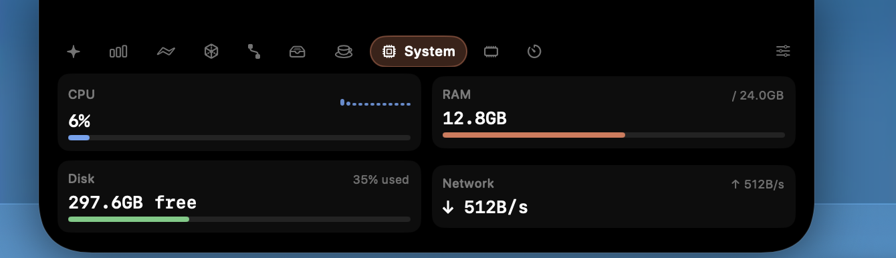
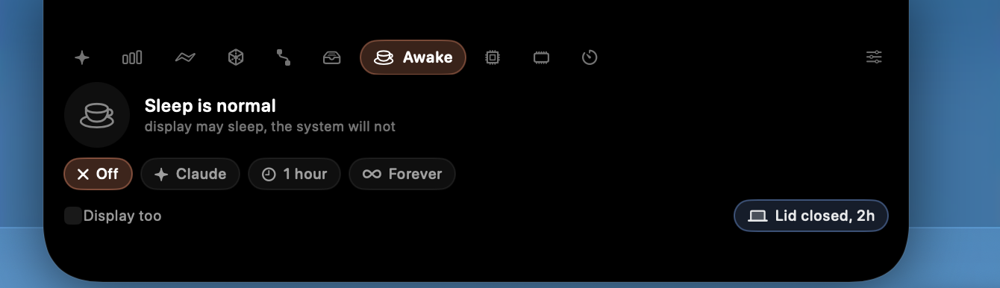

# Claude Notch

Turns the MacBook notch into a small control panel. Live Claude Code sessions, token
usage, a file shelf, system readouts, a keep-awake switch, a timer, your own commands —
whichever of those you actually want, in whatever order you want them.

<sub>macOS 14+ · Apple Silicon · no dependencies</sub>





## How it works

- **Closed**, the notch stays black with two small readouts on either side. You pick what
  goes there: Claude status, battery, CPU, memory, network speed, clock, temperature,
  timer, keep-awake, next calendar event, MCP bridge, tokens today.
- **Hover it** and the panel opens: tabs along the top, the active module below.
- **⌥Space** pins the panel open so it stays put when the pointer leaves. ✕ closes it.
- **Drag files onto it** and the panel splits in two — drop on the left to open that
  folder in Claude Code, on the right to park the files on the shelf.

## Modules

| Module | What it does |
|---|---|
| **Claude** | Live mascot plus every open session, most urgent first. Today's tokens and messages, the current 5-hour block, one-click new session, recent projects |
| **Usage** | Tokens, messages and output for today, a seven-day chart, daily average, and the split by model and by project |
| **Actions** | `/code-review`, `/security-review`, `/simplify`, `/init` and your own prompts, one click, in the last project or a folder you pick. Also scans `~/.claude/commands`, `~/.claude/agents` and **installed** plugins for commands and skills you can pin |
| **Unity** | Hub projects with their editor version, which one the running editor has open, compile errors tailed from `Editor.log`, whether the Unity MCP bridge answers, Library size, open in Unity or in Claude |
| **MCP** | Every server configured in `~/.claude.json` or a project `.mcp.json`, which projects use it, and a reachability check for the http/sse ones |
| **Shelf** | Park files in the notch, drag them back out anywhere. Double-click opens, ✕ removes |
| **Awake** | Block sleep: off, an hour, indefinitely, or automatically **while a Claude session is working**. Optionally keep the display on. Lid-closed mode too (see the notes) |
| **System** | CPU per core, memory, disk, live network throughput |
| **Memory** | Memory pressure, swap, the apps using the most RAM (helper processes included) and a polite quit for each |
| **Battery** | Charge ring, charging state, time remaining, health and cycle count |
| **Timer** | Pomodoro and break, with a round counter |
| **Commands** | Your own shell shortcuts, in a terminal window or quietly in the background |
| **Music** | Controls the Music app (asks for Automation permission the first time) |
| **Calendar** | The next 24 hours (asks for calendar access) |
| **Weather** | Temperature, feels-like, high/low and wind for a city you name — open-meteo, no API key |

Modules are switched on, off and reordered in Settings › Modules. Anything switched off
disappears from the tab bar.

## Customising it

- **General** — launch at login, open on hover and how long to wait, the ⌥Space shortcut,
  what sits either side of the notch, your city, pomodoro lengths, keep-awake behaviour.
- **Appearance** — accent colour, panel width (420–760), corner radius, opacity,
  background blur, mascot eyes.
- **Claude** — which terminal to use, extra `claude` arguments, whether to show usage.
- **Actions** and **Commands** — add, edit, reorder, choose an icon and a target folder.

## Install

```bash
./build.sh      # builds /Applications/Claude Notch.app, icon included
./install.sh    # installs the hook, wires up settings.json, launches the app
./uninstall.sh  # puts everything back
```

`install.sh` copies the hook into `~/.claude/hooks/`, backs up `~/.claude/settings.json`
and adds the hook entries. Nothing else is touched.

No permission dialogs for the core features: terminals are opened through a throwaway
`.command` file and LaunchServices rather than AppleScript. Only Music and Calendar ask
for anything, and only when you enable them.

## How the pieces fit

| File | Job |
|---|---|
| `NotchWindow.swift` | Borderless `NSPanel` one level above the menu bar. `PassthroughView` decides when the window may claim mouse events at all, and handles drag and drop |
| `NotchView.swift` | The shell: closed view with its readouts, tab bar, module body, drop zones. Content is clipped to the notch shape |
| `Modules.swift` | `ModuleKind` and `PeekSlot` — the list of modules, their titles and heights |
| `ModuleViews*.swift` | One view per module |
| `Stores.swift` | Shelf, timer, weather, calendar, music, command runner |
| `Unity.swift` | Hub project list, running-editor detection by path, error lines from the tail of `Editor.log` |
| `Mcp.swift` | MCP server discovery and a short-timeout reachability probe |
| `Power.swift` | `IOPMAssertion` keep-awake, plus a privileged helper for lid-closed mode that restores the setting itself |
| `Memory.swift` | Pressure, swap and per-app memory including processes the app is responsible for |
| `Actions.swift` | Slash command, skill and agent discovery, and running them |
| `Sensors.swift` | CPU, memory, disk, network and battery via `host_processor_info`, `host_statistics64`, `getifaddrs` and `IOPSCopyPowerSourcesInfo` |
| `Mascot.swift`, `ClaudeMark.swift` | The animated mark and a small SVG path parser |
| `UsageStore.swift` | Reads transcripts incrementally and caches per-day, per-model and per-project totals so a restart doesn't re-parse a week of JSONL |
| `SessionServer.swift` | Unix socket at `/tmp/claude-notch.sock` for hook events |
| `Launcher.swift` | Opens a terminal through a temporary `.command` file; terminal list; login item |
| `Hotkey.swift` | Carbon `RegisterEventHotKey`, so no Accessibility permission is needed |
| `Prefs.swift`, `SettingsView.swift` | Every setting, and the settings window |
| `Support/make-icon.swift` | Build-time only: renders `AppIcon.icns` from the same vector the mascot uses |

## Notes

- The hook is fire-and-forget. If the app isn't running the connection just fails and
  Claude Code carries on.
- Sessions whose terminal was closed never send `SessionEnd`, so their pids are checked
  every 45 seconds and dead rows disappear.
- Sensors refresh every 2 seconds; transcripts, projects, weather and calendar every 45.
  The heavy work stays off the main thread.
- Sessions are deliberately started with `--dangerously-skip-permissions`. There is no
  setting to turn that off.
- **Lid-closed keep-awake** changes a system-wide setting (`pmset disablesleep`). The app
  never leaves it on by itself: an admin-authorised helper flips it and puts it back when
  its deadline passes **or** when `/tmp/claude-notch-lid-awake` disappears. So a crash, a
  force-quit or deleting the app can't leave the Mac unable to sleep. The Undo button just
  removes that file.
- Every other keep-awake mode is a power assertion and dies with the process. No password.
- A Unity project's `Library` folder is never deleted, only measured and revealed. Deleting
  it while the editor is open corrupts the project.
- The menu bar icon carries the session colour: orange thinking, blue running a tool,
  green waiting for you, amber waiting for approval.
- Each `./build.sh` produces a fresh ad-hoc signature. macOS ties permissions to the
  signature, so Automation and Calendar access may be asked for again after a rebuild.
- The Claude starburst is Anthropic's trademark; the path data comes from Simple Icons
  (CC0). Fine for a personal build — check for yourself before distributing anything with
  it.
